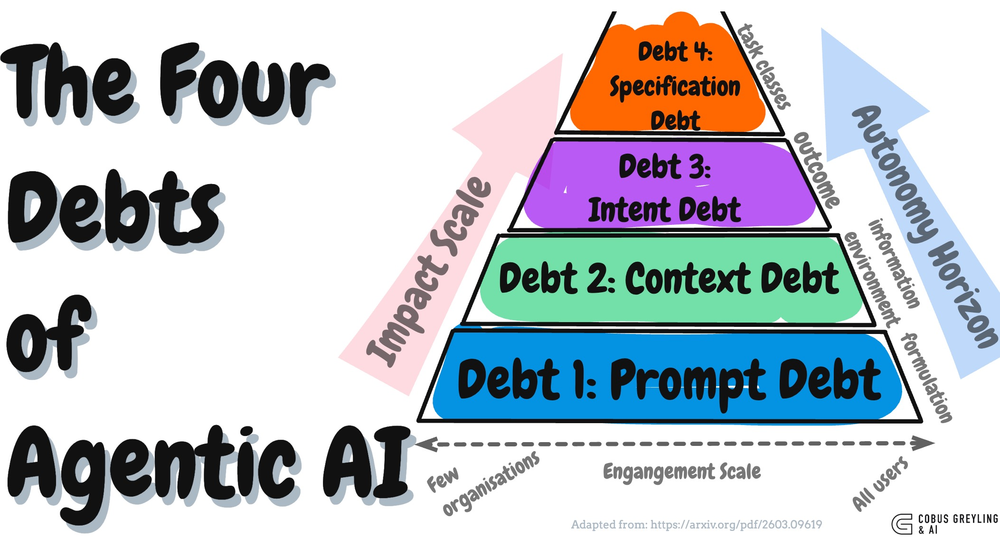

# The Four Debts of Agentic AI



Every layer of agent engineering you skip becomes debt that compounds until it breaks something you care about.

This repo accompanies a blog post exploring the **cumulative four-level pyramid maturity model** from Vishnyakova (2026), reframed as a debt model for agentic AI systems.

## The Four Debts

| Debt | What You Skipped | What Breaks |
|------|-----------------|-------------|
| **Prompt Debt** | Precision in model instructions | Inconsistent outputs, edge-case explosion |
| **Context Debt** | Designing the agent's informational environment | Agent "lost in the middle," stale data, security gaps |
| **Intent Debt** | Encoding what to optimise for | Technically correct, strategically blind (the Klarna effect) |
| **Specification Debt** | Machine-readable corporate policies | Contradictory decisions across divisions, no audit trail |

## Interactive Demo

The demo runs the **same customer-service scenario** through all four pyramid levels, showing how the agent's decision changes as each engineering layer is added.

**The scenario:** Maria Chen, a Platinum-tier customer with $42K lifetime value, requests a refund on $350 headphones. Watch the agent go from "instant generic refund" to "strategically informed retention attempt with audited, policy-compliant bonus."

### Run it

```bash
# Terminal mode (no dependencies)
python3 four_debts_demo.py

# With interactive UI
pip install gradio
python3 four_debts_demo.py
```

No API key needed -- the demo uses deterministic simulation to make the engineering patterns visible.

### What you'll see

**Level 1 (Prompt Only)** -- Generic refund approval. No customer data, no logic, no guardrails.

**Level 2 (+ Context Engineering)** -- Personalised refund approval. Knows Maria is Platinum with $42K LTV, but still approves the refund instantly because no one told the agent what to optimise for.

**Level 3 (+ Intent Engineering)** -- Retention attempt before refund. Same data, different decision -- because trade-off hierarchies now tell the agent that a $42K customer returning a $350 item is a retention opportunity, not just a transaction.

**Level 4 (+ Specification Engineering)** -- Same retention attempt, but with policy-compliant bonus ($52.50 per REF-003), audit trail, provenance tracking, and pre-flight validation. Every agent in the organisation applies the same rules.

## Key Concepts from the Paper

- **Context as operating system** -- The agent's context isn't just the prompt; it's the entire informational environment including retrieved data, memory, tool results, and visibility boundaries.
- **Five quality criteria** -- Relevance, sufficiency, isolation, economy, provenance.
- **Intent engineering** -- Encoding corporate trade-off hierarchies (retention vs. cost, compliance vs. speed) into agent infrastructure.
- **Specification engineering** -- Machine-readable corporate knowledge as a constitutional layer for multi-agent systems.
- **The Principal Trap** -- No-code tools collapsed the creation threshold, making it trivial to deploy agents that carry invisible engineering debt.

## Blog Post

Read the full analysis: [blog.md](blog.md)

## Reference

Vishnyakova, V.V. (2026). *Context Engineering: From Prompts to Corporate Multi-Agent Architecture.* [arXiv:2603.09619v2](https://arxiv.org/abs/2603.09619)

## Author

**Cobus Greyling** -- Chief AI Evangelist @ Kore.ai

Where AI Meets Language | Language Models, AI Agents, Agentic Applications, Development Frameworks & Data-Centric Productivity Tools

[cobusgreyling.com](https://www.cobusgreyling.com)
